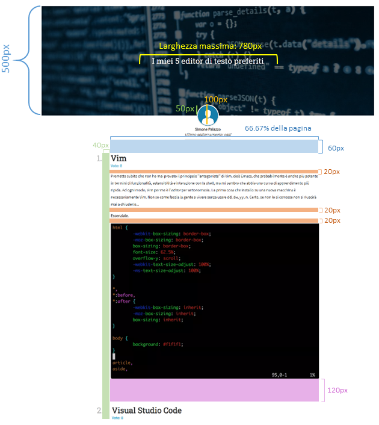

## Mini-homework 1

In questo MHW, utilizzerete le nozioni di HTML e CSS che abbiamo visto a lezione per creare la home page del vostro progetto.

La consegna del MHW dovrà essere effettuata sul vostro repository GitHub e dovrà includere:
* i file `mhw1.html`, `mhw1.css` e le immagini da inserire nella pagina;
* una presentazione in PowerPoint, `mhw1.pptx`, che descrive l'implementazione e le specifiche utilizzate nella pagina.

**Importante**: i file devono essere caricati direttamente nella cartella principale del repository, non in sottocartelle né in file compressi (es. zip). Inoltre, il nome del repository **deve essere testualmente `mhw1`**, non `MHW1` o `minihomework1` o qualunque altra cosa.

### 1. Aspetto generale

La struttura della pagina è a vostra scelta, ma dovrà contenere i seguenti elementi:
* una **intestazione (header)** con il titolo della pagina e un'immagine di sfondo;
* un **menù di navigazione**, disposto orizzontalmente in alto o verticalmente a lato, contenente dei link alle altre sezioni del sito (non è necessario che le pagine a cui fanno riferimento i link esistano);
* una sezione di **contenuti**, che rappresenta il corpo principale della pagina. Questa sezione dovrà essere a sua volta divisa in "blocchi" di informazione (da disporre a vostro piacere utilizzando Flexbox), specifiche per il vostro progetto di sito (es., se si tratta di un quotidiano inline, ogni blocco può rappresentare una notizia; se si tratta di un'agenzia di viaggi, ogni blocco può rappresentare un volo o una prenotazione);
* un **footer** che contiene informazioni sulla pagina (tra cui nome, cognome, matricola).

[A questo link](imgs/mhw1_esempio.png) un esempio di visualizzazione della pagina completa.

### 2. Misure delle sezioni

Stabilite in dettaglio la disposizione delle sezioni del sito (header, menù di navigazione, contenuti, blocchi all'interno dei contenuti, footer) e le distanze tra i diversi elementi della pagina. Illustrate il vostro progetto nella presentazione in maniera analoga a quanto vedete in questa immagine:

E' richiesto l'uso delle seguenti proprietà CSS: `margin`, `padding`, `height` `position`, `border`, `border-radius`, `background-color`.

### 3. Caratteri, dimensioni e colori

Definite il carattere, il colore e la dimensione del testo in ciascuna delle sezioni della pagina definite in "Aspetto generale". Se i blocchi di contenuto sono a loro volta divisibili in sotto-parti, usate uno stile diverso per ciascuna.

Per ogni sezione di testo, definite tramite CSS:
* un carattere principale (da Google Fonts) e un carattere di riserva (non da Google Fonts);
* la dimensione del testo;
* lo stile del testo;
* il colore del testo;
* l'allineamento rispetto al contenitore.

E' richiesto l'uso delle seguenti proprietà CSS: `font-weight`, `font-style`, `font-family`, `font-size`, `color`, `line-height`.

### 4. Immagini

L'intestazione ha un'immagine di sfondo, che non si ripete. Al di sopra dell'immagine vi è un overlay semitrasparente, di colore `rgba(0, 0, 0, .3)`.

La sezioni dei contenuti deve contenere un'immagine per ogni "blocco" di informazione.

## Altre specifiche HTML e CSS

Per una piena valutazione, rispettate le seguenti specifiche:

-   **Utilizzate l'HTML e il CSS che abbiamo visto a lezione.** Non utilizzate codice HTML/CSS che non abbiamo studiato, a meno che non vi sia una valida motivazione, da giustificare nella presentazione. Non utilizzate librerie aggiuntive (es. Bootstrap).
    - **Nota:** qualora riscontriate problemi relative all'ordine con cui certi elementi si sovrappongono (ad es., l'overlay e il testo dell'header; oppure l'header e l'immagine di profilo), utilizzate la proprietà [`z-index`](https://developer.mozilla.org/en-US/docs/Web/CSS/z-index). 
-   **Non usate JavaScript**. Non è necessario usare JavaScript in questo homework.
-   **Rispettate la separazione delle responsabilità**. Il vostro codice HTML deve descrivere il contenuto e la struttura della pagina, e il vostro codice CSS deve descrivere l'aspetto della pagina.
-    **Mobile web**. Aggiungete opportunamente il codice HTML e CSS necessario affinchè il sito sia fruibile da dispositivi mobili (effettuate i test tramite il _device mode_ di Google Chrome).
-   **Seguite le linee guida** che abbiamo presentato durante le lezioni.
-   **Minimizzate la ridondanza nel CSS.** Cercate di non avere regole di stile ridondanti, se c'è il modo di sfruttare l'ereditarietà o la specificità.
-   **Usate nomi descrittivi, indentate il codice,** e in generale seguite le buone norme relativa alla programmazione.
